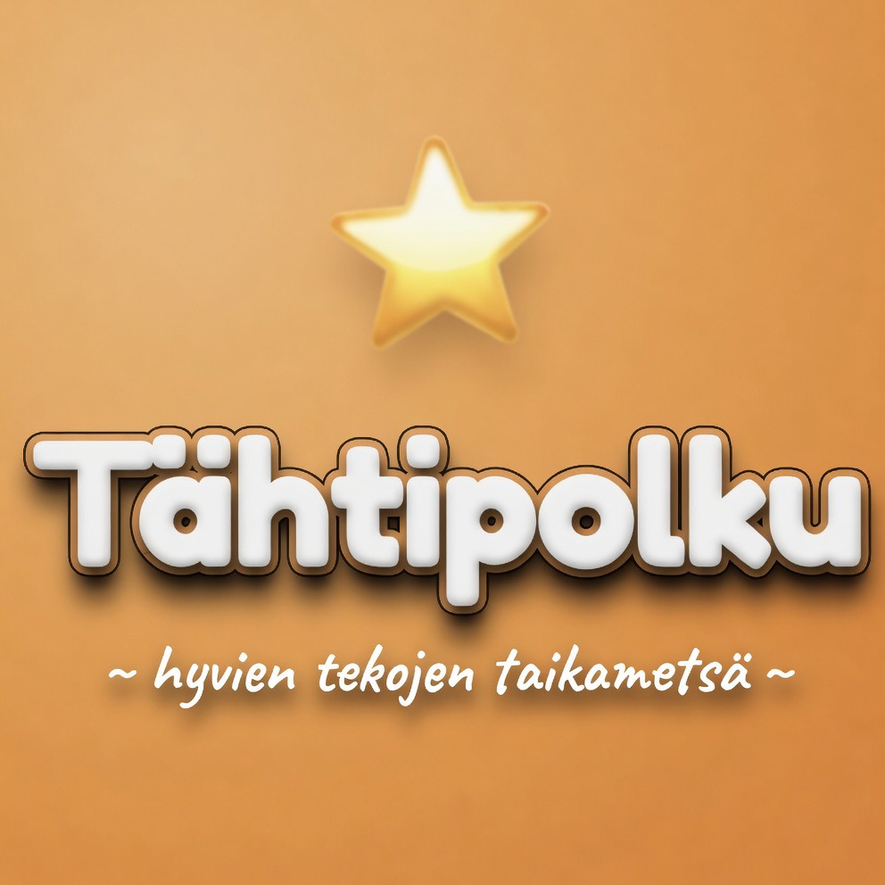

# 🌟 Tähtipolku (Star Path)

A reward tracker for children's good deeds — a magical journey through the Enchanted Forest.

Tähtipolku is a free web application for families. Children earn stars for good deeds, and unlock small rewards when enough stars are collected. The entire app is in Finnish.

**Live:** [tahtipolku.web.app](https://tahtipolku.web.app)

## ✨ Features

- **Family Setup**: add 1–6 children, give them names, choose roles for each in the forest (Fox Knight, Butterfly Fairy, Bear Adventurer, Dragon Hero, and 10 more options)
- **Custom Deeds**: define your own good deeds and how many stars they earn (1–3 stars per deed)
- **3-Tier Reward System**: 10 ⭐ Candy, 25 ⭐ Ice Cream, 50 ⭐ Amusement Park or Movies
- **Enchanted Forest Story**: Moon Elves, Star Trees, and the Queen of the Enchanted Forest
- **Celebrations**: confetti and triumphant music when reward milestones are reached
- **Sound Design**: cheerful click sounds for deeds, soft undo tones, joyful milestone fanfare
- **Multi-device sync**: optional Google Sign-In syncs progress across phone, tablet, and laptop
- **Works Offline**: once loaded, the app works without internet
- **Install to Home Screen**: on iPhone, iPad, and Android — "Add to Home Screen" makes it look like a real app

## 🚀 Usage

1. Open [tahtipolku.web.app](https://tahtipolku.web.app) in browser
2. Complete onboarding (add children and deeds)
3. (Optional) Sign in with Google to sync data across devices
4. On phone or tablet: tap Share → "Add to Home Screen"
5. Collect stars together!

Without sign-in, all data stays on the device's localStorage. With sign-in, data syncs to Firestore under the parent's account.

## 🛠 Technology

- Vanilla HTML/CSS/JavaScript — single file, no build step
- Firebase Auth (Google Sign-In) + Firestore for optional cloud sync
- Firebase Hosting for deployment
- Web Audio API for sound (no audio files)
- Service Worker for offline support
- PWA manifest for home screen installation
- localStorage as primary storage (Firestore mirrors when signed in)

## 📁 Project Structure

- `index.html` — entire app (HTML, CSS, JS in one file)
- `manifest.json` — PWA manifest
- `sw.js` — service worker
- `assets/` — icon and OG share image
- `firebase.json`, `.firebaserc` — Firebase Hosting config
- `tahtipolku-spec.md` — full product specification

## 📄 License

MIT — see [LICENSE](./LICENSE)
